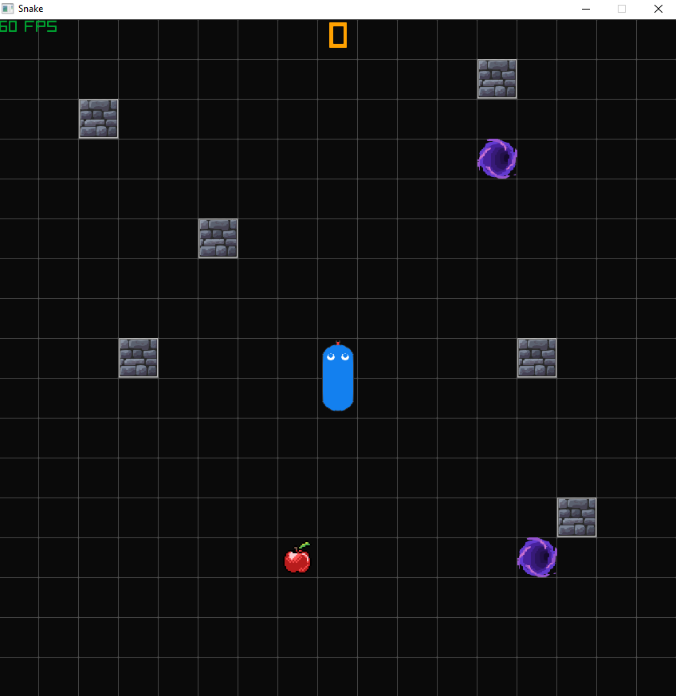

# Snake
Welcome to Snake, a classic game with a twist! This version introduces challenging elements such as portals and walls, adding a new layer of strategy to the familiar gameplay.



# Controls
## Keyboard
- **W/A/S/D or up/down/left/right:** Control the snake's movement.  
- **Space:** Resume the game after the failed/success screen.
- **R:** Reset the game or create a new level layout.  
- **ESC:** Pause/resume the game.

## Controller
Here, the PS4 controller buttons are used as an example, but other controllers will work as well:
- **DPAD:** Control the snake's movement.  
- **X:** Resume the game after the failed/success screen.
- **△:** Reset the game or create a new level layout.  
- **OPTIONS:** Pause/resume the game.

If you encounter issues with controller input, please verify that you have selected the correct controller, ensuring it corresponds to the one initially assigned by your PC.

# Build Instructions
## Prerequisites
### Linux
Following libraries have to be installed and accessible to the current user:
- xorg (should contain:)
  - libx11
  - libxcursor
  - libxrandr
  - libxinerama
  - libxi

## Using premake
For the web assembly build, clone the repository then proceed [here](#build-web-assembly).  
This project utilizes Premake as its build system, offering seamless integration with Visual Studio, Clang, and GCC. To set up the project, follow these steps:

## Clone the repository

``` bash
git clone https://github.com/pyvyx/Snake.git
```
``` bash
cd Snake
```

## Visual Studio

``` bash
vendor\premake5.exe vs2022
```
This should generate a .sln file

## Make

Windows:
``` bash
vendor\premake5.exe gmake2 [cc]
```

Linux:
``` bash
vendor/premake5linux gmake2 [cc]
```

macOS:
``` bash
vendor/premake5macos gmake2 [cc]
```

GCC should be the default compiler on Windows and Linux, macOS uses Clang by default, but you can explicitly specify it if you want.  
GCC:   --cc=gcc  
Clang: --cc=clang  
There are also other compilers available however building has only been tested with gcc, clang and msvc

### Build

``` bash
make [-j] config=<configuration>
```

### Build web assembly
``` bash
make -f Makefile.Web [-j] config=<configuration>
```

Configurations:
 - debug_x86
 - debug_x64 (default, the same as just using `make`)
 - release_x86
 - release_x64

macOS:
 - debug_universal (default, the same as just using `make`)
 - release_universal

web assembly:
 - debug (default, the same as just using `make`)
 - release

`-j` flag utilises multi-threaded compilation

``` bash
make help
```
to get a list of all the available configurations

## Additional Information
For more details on Premake options, use the following commands:

Windows:
``` bash
vendor\premake5.exe --help
```

Linux:
``` bash
vendor/premake5linux --help
```

macOS:
``` bash
vendor/premake5macos --help
```

## Troubleshooting
If you experience linking errors on Linux, resolve them by adding the necessary libraries to `Snake/premake5.lua`. Ensure these libraries are added before the last line in the file:

``` lua
filter {}
```

For linking errors, use this example:
``` lua
filter "system:linux"
    links {
        "GL",
        "X11",
        "rt",
        "dl",
        "m"
    }
```

For missing include directories, use this example:
``` lua
filter "system:linux"
    links {
        "GL",
        "X11",
        "rt",
        "dl",
        "m"
    }

    includedirs {
        "src/",
        "include/
    }
```

Make sure to tailor these adjustments to accommodate any specific libraries or directories required for successful compilation on the Linux platform.